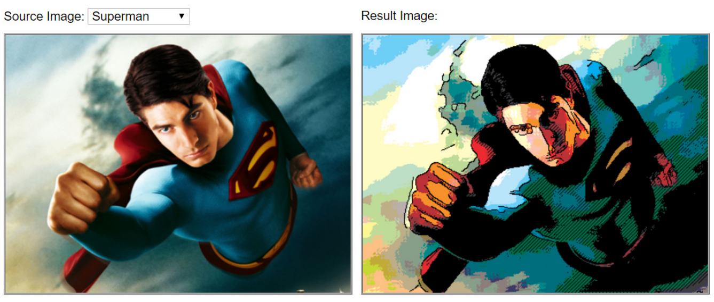

# COMICification

## Introduction

This project combines some image processing techniques to create interesting ‘1980s comic book’ style images.

The input to the system is an ordinary photo and the output is a comic-style image of that photo.

## The COMICification Process

## The Image Processing Techniques

- Top layer – outlines
  - Canny edge detection
- Middle layer – shades
  - Ordered dithering
- Bottom layer – colour
  - Mapping colours to a comic colour palette

